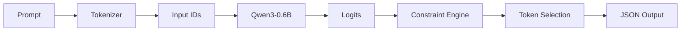

*This project has been created as part of the 42 curriculum by hel-hamo.*

# Call Me Maybe

## Introduction to Function Calling in LLMs

> Does an LLM speak the language of computers?
>
> This project explores how small language models can be transformed from natural language generators into reliable structured-output systems through constrained decoding.

---

# Table of Contents

* [Description](#description)
* [Architecture Overview](#architecture-overview)
* [Instructions](#instructions)
* [Constrained Decoding Algorithm](#constrained-decoding-algorithm)
* [Design Decisions](#design-decisions)
* [Performance Analysis](#performance-analysis)
* [Challenges Faced](#challenges-faced)
* [Testing Strategy](#testing-strategy)
* [Example Usage](#example-usage)
* [Resources](#resources)

---

# Description

## What is this project?

Call Me Maybe is a function-calling engine for Small Language Models.

The goal is not to answer user questions directly, but rather to transform natural language requests into structured function invocations that can later be executed by external systems.

Example:

Input:

```text
What is the sum of 40 and 2?
```

Expected output:

```json
{
    "prompt": "What is the sum of 40 and 2?",
    "name": "fn_add_numbers",
    "parameters": {
        "a": 40,
        "b": 2
    }
}
```

---

## Problem Statement

Large Language Models are excellent at generating human-readable text but are unreliable when generating machine-readable structures.

Even modern models frequently produce:

* malformed JSON
* missing fields
* invalid types
* extra keys
* hallucinated arguments
* schema violations

Small models such as Qwen3-0.6B are especially vulnerable to these issues.

This project solves the problem by implementing constrained decoding that guarantees:

* valid JSON generation
* schema compliance
* type correctness
* deterministic structure
* recoverable output

---

## Why Function Calling Matters

Function calling enables LLMs to:

* interact with APIs
* query databases
* control applications
* execute tools
* trigger workflows
* operate autonomous agents

Without function calling, LLMs remain isolated text generators.

With function calling, they become programmable systems.

---

## Why Constrained Decoding Is Necessary

Prompt engineering alone cannot guarantee structured output.

A model may generate:

```json
{
    "function": "fn_add_numbers",
    "arguments": {
        "a": 2,
        "b":
```

or:

```json
{
    "function": "fn_add_numbers",
    "arguments": {
        "a": "two",
        "b": 3
    }
}
```

Production systems therefore modify generation itself rather than relying on prompting.

Constrained decoding transforms generation from:

```text
Generate anything likely.
```

into:

```text
Generate only tokens that keep the output valid.
```

---

# Architecture Overview



---

## High Level Components

### Input Loader

Responsible for:

* loading prompts
* loading function schemas
* validating input JSON

---

### Prompt Builder

Constructs the LLM prompt containing:

* user request
* available functions
* descriptions
* parameter information

---

### Small LLM SDK

Provides:

```python
get_logits_from_input_ids()
encode()
decode()
get_path_to_vocab_file()
```

---

### Constraint Engine

Responsible for:

* token filtering
* schema enforcement
* JSON validity
* state transitions
* incremental validation

---

### Output Writer

Produces:

```text
data/output/function_calling_results.json
```

---

# Instructions

## Requirements

| Component       | Requirement      |
| --------------- | ---------------- |
| OS              | Linux            |
| Python          | 3.10+            |
| Package Manager | uv               |
| RAM             | 8 GB recommended |
| Model           | Qwen3-0.6B       |
| GPU             | Optional         |

---

## Installation

Clone the repository:

```bash
git clone <repository_url>
cd call_me_maybe
```


---

## Dependencies

```bash
uv sync
```
---

## Execution

Default execution:

```bash
uv run python -m src
```

Custom files:

```bash
uv run python -m src \
    --functions_definition custom_functions.json \
    --input prompts.json \
    --output results.json
```

---

## Makefile

Install dependencies:

```bash
make install
```

Run:

```bash
make run
```

Debug:

```bash
make debug
```

Lint:

```bash
make lint
```

Strict lint:

```bash
make lint-strict
```

Clean caches:

```bash
make clean
```

---

## Troubleshooting

### Invalid JSON input

Validate:

```bash
python -m json.tool <file.json>
```

---

### Missing dependencies

Run:

```bash
uv sync
```

---

# Constrained Decoding Algorithm

## Generation Pipeline

```text
Prompt
 ↓
Tokenization
 ↓
Input IDs
 ↓
LLM Forward Pass
 ↓
Logits
 ↓
Constraint Filtering
 ↓
Valid Tokens
 ↓
Token Selection
 ↓
Append Token
 ↓
Repeat
```

---

## Token Generation Loop

```text
while generation_not_finished:
    logits = model.get_logits()
    allowed = constraint_engine.allowed_tokens()
    filtered_logits = apply_constraints(logits)
    token = select_best(filtered_logits)
    append(token)
```

---

## Logits Retrieval

The model returns a score for every vocabulary token:

```text
token_1 -> -2.5
token_2 -> 1.7
token_3 -> 7.9
```

The decoder never modifies probabilities directly.

Instead it masks invalid candidates.

---

## Vocabulary Filtering

For every generation step:

```text
allowed_tokens = {
    token
    if token_keeps_json_valid
}
```

Invalid tokens receive:

```text
-∞
```

which guarantees they cannot be selected.

---

## State Management

The decoder maintains:

* current object depth
* current array depth
* active key
* active schema node
* current value type
* string state
* number state

---

## Number Handling

Allowed tokens:

```text
0-9
-
.
e
E
```

---

## String Handling

Allowed states:

```text
opening quote
content
escape sequence
closing quote
```

Invalid strings are rejected before generation continues.

---

Any other token sequence is rejected.

---

## Null Handling

Accepted sequence:

```json
null
```

---


## Schema Enforcement

The schema controls:

* field existence
* field ordering
* type validation
* required fields
* nested structures

A token is accepted only if:

```text
JSON valid
AND
schema valid
```

---

# Design Decisions

## Greedy Decoding

### Selected

Greedy decoding with constrained vocabulary.

## Pydantic Models

Used for:

* input validation
* schema validation
* output validation

Advantages:

* type safety
* maintainability

---

# Example Usage

Prompt:

```text
What is the sum of 2 and 3?
```

Output:

```json
{
    "prompt": "What is the sum of 2 and 3?",
    "name": "fn_add_numbers",
    "parameters": {
        "a": 2,
        "b": 3
    }
}
```

## Invalid Output Rejection

Rejected:

```json
{
    "a": "hello"
}
```

Expected:

```json
{
    "a": 42
}
```

---

# Resources

## Documentation

* [Transformers-pdf](https://web.stanford.edu/~jurafsky/slp3/8.pdf)
* [JSON serialization and desirialization](https://medium.com/@ashaicy/serialization-and-deserialization-techniques-in-python-deserialization-69beed1ed3ef)
* [Pydantic Documentation](https://pydantic.dev/docs/validation/latest/api/pydantic/json_schema/)
* [tokenization algorithms](https://huggingface.co/docs/transformers/en/tokenizer_summary)

## Research Papers

* Structured Generation via Constrained Decoding
* [Outlines](https://github.com/dottxt-ai/outlines/tree/main/src/outlines) 

## Educational Resources

* LLM videos

---

## Manually implemented components

* constrained decoding logic
* parser state management
* schema validation
* generation pipeline
* vocabulary filtering
* token masking

All implementation details were understood, reviewed, and validated manually before inclusion in the final project.
